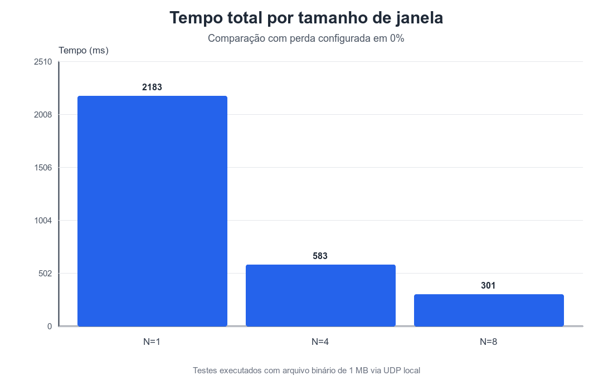
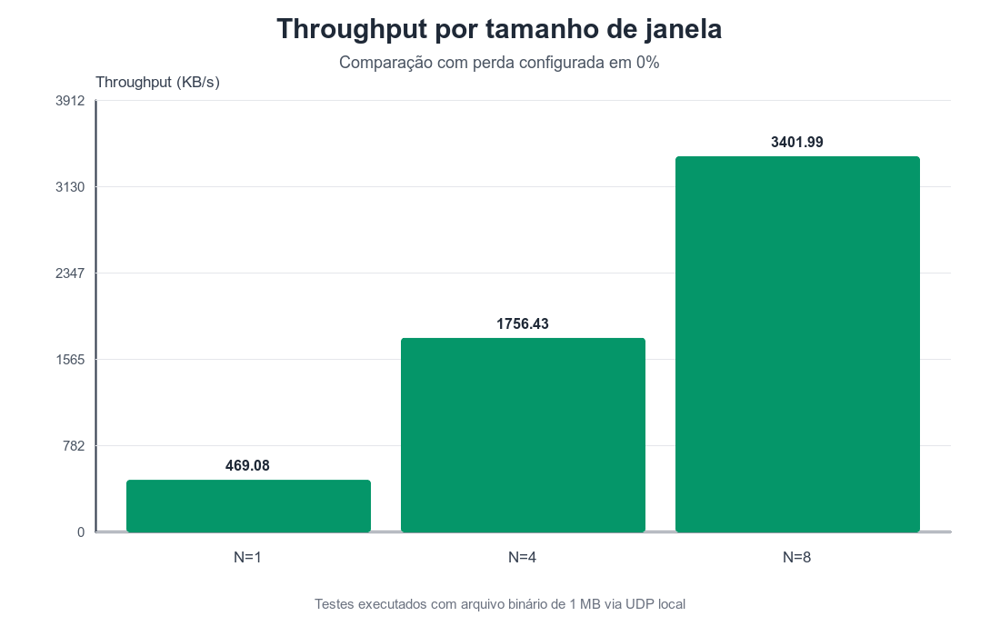
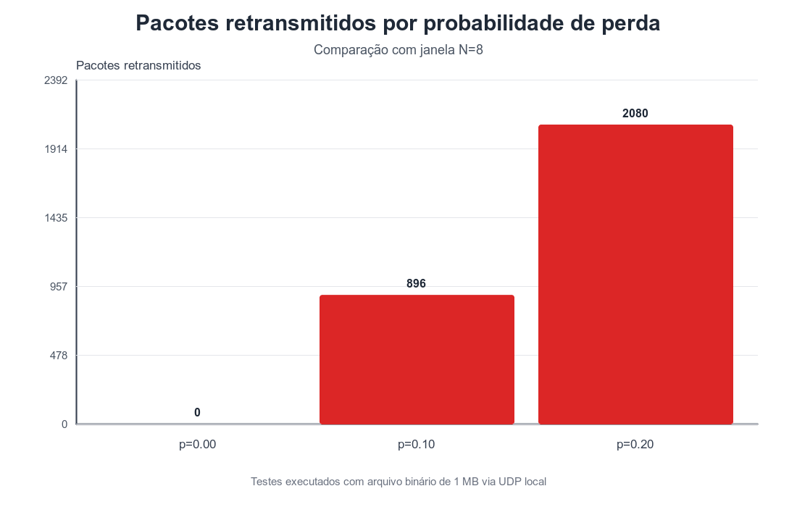

# Implementação do Protocolo Go-Back-N em Java via UDP

**Disciplina:** Redes de Computadores  
**Instituição:** Universidade Federal de Alfenas (UNIFAL-MG)  
**Curso:** Bacharelado em Ciência da Computação  
**Tema:** Transferência confiável de arquivos sobre UDP com janela deslizante Go-Back-N

## 1. Introdução

A transferência confiável de dados é um requisito central em aplicações de rede que precisam transportar arquivos sem perda, duplicação lógica ou alteração de conteúdo. O protocolo UDP fornece um serviço de datagramas simples, sem conexão, mas não garante entrega, ordem, controle de fluxo ou confiabilidade. Por esse motivo, quando se utiliza UDP em uma aplicação que exige entrega correta, a camada de aplicação deve implementar mecanismos próprios de controle.

Este trabalho implementa o protocolo Go-Back-N em Java usando exclusivamente sockets UDP. A confiabilidade foi construída na aplicação por meio de numeração de pacotes, janela deslizante, confirmações cumulativas, temporizador e retransmissão. O sistema transfere arquivos binários reais entre um emissor e um receptor, simula perda de pacotes no receptor e verifica a integridade do arquivo recebido por meio de hash MD5.

## 2. Objetivo

O objetivo do projeto é implementar uma transferência confiável de arquivos sobre UDP utilizando o protocolo Go-Back-N, seguindo a lógica apresentada para protocolos de transferência confiável com janela deslizante. A implementação deve permitir variar o tamanho da janela de transmissão `N` e a probabilidade de perda simulada, coletar estatísticas da execução e analisar o impacto desses parâmetros no tempo de transferência, no throughput e na quantidade de retransmissões.

Também é objetivo demonstrar que arquivos binários podem ser transmitidos corretamente mesmo sobre UDP, desde que a aplicação implemente os mecanismos de confiabilidade necessários. A verificação final é feita comparando o MD5 do arquivo original com o MD5 do arquivo recebido.

## 3. Protocolo Go-Back-N

O Go-Back-N é um protocolo de janela deslizante no qual o emissor pode manter até `N` pacotes não confirmados simultaneamente. A variável `base` representa o número de sequência do pacote mais antigo ainda sem confirmação. A variável `nextSeqNum` indica o próximo número de sequência disponível para transmissão. A variável `windowSize` define o tamanho da janela, isto é, a quantidade máxima de pacotes que podem estar em trânsito sem confirmação.

O receptor mantém a variável `expectedSeqNum`, que indica o próximo pacote esperado em ordem. O receptor aceita apenas pacotes cujo número de sequência seja exatamente igual a `expectedSeqNum`. Pacotes fora de ordem são descartados e não são armazenados. Nessa situação, o receptor reenvia o último ACK cumulativo já emitido, informando ao emissor qual foi o último pacote recebido corretamente em ordem.

O ACK cumulativo confirma todos os pacotes até determinado número de sequência. Quando o emissor recebe um ACK de número `n`, ele pode avançar `base` para `n + 1`, pois todos os pacotes até `n` foram reconhecidos pelo receptor. Caso ocorra timeout, o emissor retransmite todos os pacotes atualmente não confirmados, de `base` até `nextSeqNum - 1`. Esse comportamento caracteriza o Go-Back-N: ao detectar falha na janela, o emissor retorna ao pacote mais antigo sem confirmação e reenvia a sequência pendente.

Nesta implementação, o emissor utiliza um temporizador único associado ao pacote mais antigo não confirmado. O temporizador é iniciado quando a janela deixa de estar vazia, reiniciado quando ainda existem pacotes pendentes após o avanço de `base` e cancelado quando todos os pacotes foram confirmados.

## 4. Arquitetura da implementação

A implementação é composta por três classes principais: `Emissor`, `Receptor` e `Pacote`.

O `Emissor` é responsável por ler o arquivo de origem, dividi-lo em segmentos de até 1024 bytes, criar os pacotes de dados, controlar a janela deslizante, receber ACKs cumulativos em uma thread dedicada, gerenciar o temporizador e retransmitir pacotes em caso de timeout. Ele também envia um pacote de handshake antes da transferência e um pacote `FIN` ao final.

O `Receptor` aguarda o handshake inicial em uma porta UDP configurável. Após receber os parâmetros da sessão, passa a executar a lógica do receptor Go-Back-N: aceita apenas pacotes em ordem, grava o payload no arquivo de destino, calcula o MD5 do conteúdo recebido e envia ACKs cumulativos. Pacotes fora de ordem são descartados e recebem como resposta o último ACK enviado.

A classe `Pacote` define a estrutura comum dos datagramas do protocolo. Ela concentra os tipos de pacote, os tamanhos máximos, o cabeçalho e os métodos de serialização e desserialização com `ByteBuffer`. Essa separação reduz duplicação entre emissor e receptor e mantém o formato de datagrama em um único ponto do código.

## 5. Formato dos datagramas

Cada datagrama UDP encapsula um pacote com cabeçalho de 11 bytes e payload de até 1024 bytes. O payload é usado para dados do arquivo nos pacotes `DATA` e para parâmetros textuais no pacote `HANDSHAKE`.

| Campo | Tamanho | Descrição |
| --- | ---: | --- |
| `tipo` | 1 byte | Identifica o pacote: `0=DATA`, `1=ACK`, `2=HANDSHAKE`, `3=FIN` |
| `num_seq` | 4 bytes | Número de sequência usado em pacotes de dados |
| `num_ack` | 4 bytes | Número de confirmação usado em ACKs |
| `tamanho_dados` | 2 bytes | Quantidade de bytes válidos no payload |
| `dados` | até 1024 bytes | Payload do arquivo ou parâmetros de controle |

O pacote `HANDSHAKE` carrega a probabilidade de perda, o caminho de destino e o tamanho total do arquivo. Os pacotes `DATA` carregam segmentos do arquivo. Os pacotes `ACK` confirmam cumulativamente o último pacote recebido em ordem. O pacote `FIN` sinaliza o encerramento da transmissão após todos os dados terem sido confirmados.

## 6. Funcionamento do Emissor

O emissor recebe pela linha de comando o arquivo de origem, o endereço de destino no formato `<IP_destino>:<path_destino>`, o tamanho da janela `N`, a probabilidade de perda simulada e, opcionalmente, a porta UDP do receptor. Antes de iniciar a transmissão, valida os argumentos e envia um pacote de handshake ao receptor.

Depois da confirmação do handshake, o arquivo é dividido em segmentos de até 1024 bytes. Cada segmento é encapsulado em um pacote `DATA` numerado sequencialmente. A janela de transmissão é controlada por `base`, `nextSeqNum` e `windowSize`. Enquanto `nextSeqNum` estiver dentro do intervalo permitido pela janela, o emissor transmite novos pacotes.

Uma thread separada recebe ACKs do receptor. Ao receber um ACK cumulativo `n`, o emissor atualiza `base` para `n + 1`. Se ainda houver pacotes sem confirmação, o temporizador único é reiniciado; caso contrário, ele é cancelado. Quando ocorre timeout, o emissor retransmite todos os pacotes de `base` até `nextSeqNum - 1` e incrementa as estatísticas de retransmissão e eventos de timeout.

Ao final, após todos os segmentos terem sido confirmados, o emissor cancela o temporizador, envia o pacote `FIN` e apresenta estatísticas da execução: total de segmentos, pacotes enviados, ACKs recebidos, pacotes retransmitidos, eventos de timeout, tempo total, throughput estimado e MD5 do arquivo original.

## 7. Funcionamento do Receptor

O receptor deve ser iniciado antes do emissor. Ele abre um `DatagramSocket` na porta configurada e aguarda o pacote de handshake. A partir do handshake, obtém a probabilidade de perda simulada, o caminho de gravação do arquivo recebido e o tamanho total do arquivo.

Durante a transferência, o receptor mantém `expectedSeqNum`. Quando recebe um pacote `DATA` com `num_seq == expectedSeqNum`, o pacote está em ordem e pode ser processado. Antes de gravar o payload, o receptor aplica a simulação de perda configurada. Se o pacote não for descartado pela simulação, seus dados são gravados no arquivo de destino, o hash MD5 é atualizado, um ACK cumulativo é enviado e `expectedSeqNum` avança.

Se o receptor recebe um pacote com número de sequência diferente de `expectedSeqNum`, o pacote é tratado como fora de ordem. Nesse caso, ele é descartado, não é gravado no arquivo e o receptor reenvia o último ACK cumulativo. O receptor não mantém buffer para pacotes fora de ordem, o que está de acordo com a política do Go-Back-N.

## 8. Simulação de perda de pacotes

A perda de pacotes é simulada no receptor para permitir avaliar o comportamento do protocolo em uma rede local, onde a perda real normalmente é baixa. Para cada pacote recebido em ordem, o receptor sorteia um valor `r` no intervalo `[0, 1)`. Se `r < prob_perda`, o pacote é descartado silenciosamente: o payload não é gravado, nenhum ACK é enviado e `expectedSeqNum` não avança.

As perdas simuladas são aplicadas somente a pacotes recebidos em ordem. Pacotes fora de ordem já são descartados pela própria FSM do Go-Back-N e, portanto, não são contabilizados como perdas simuladas. Essa separação permite distinguir perdas artificiais de descartes causados pela chegada de pacotes fora de ordem após uma perda anterior.

## 9. Decisões de projeto

A implementação utiliza UDP para cumprir o requisito de comunicação por datagramas sem confiabilidade nativa. A confiabilidade foi implementada na aplicação com ACK cumulativo, janela deslizante, temporizador único e retransmissão da janela pendente.

O payload máximo foi definido em 1024 bytes. Esse tamanho simplifica a segmentação do arquivo, mantém datagramas com tamanho previsível e permite transferir arquivos binários sem depender de codificação textual. O cabeçalho fixo de 11 bytes contém apenas os campos necessários para identificar o tipo do pacote, numerar dados, confirmar recebimentos e indicar o tamanho válido do payload.

O emissor carrega os segmentos do arquivo e monta os pacotes antes da transmissão. Essa decisão simplifica a retransmissão, pois o pacote a ser reenviado já está disponível no buffer. Para o escopo dos testes, com arquivo de 1 MB, essa estratégia é adequada e reduz a complexidade em relação à releitura do arquivo em cada timeout.

O receptor não armazena pacotes fora de ordem. Essa escolha segue diretamente o protocolo Go-Back-N e evita a lógica adicional de reordenação, que seria característica de protocolos como Selective Repeat.

## 10. Metodologia de testes

Os testes utilizaram um arquivo binário de 1 MB, com 1.048.576 bytes. Como o payload máximo é de 1024 bytes, o arquivo foi dividido em 1024 segmentos. A matriz de testes variou o tamanho da janela `N` e a probabilidade de perda simulada, cobrindo os seguintes cenários reais registrados:

| Teste | Janela `N` | Perda configurada |
| ---: | ---: | ---: |
| 1 | 1 | 0.00 |
| 2 | 4 | 0.00 |
| 3 | 8 | 0.00 |
| 4 | 4 | 0.10 |
| 5 | 8 | 0.10 |
| 6 | 8 | 0.20 |

Para cada execução foram registrados o tempo total de transferência, o throughput estimado, o total de pacotes enviados, o total de ACKs recebidos, a quantidade de pacotes retransmitidos, a quantidade de eventos de timeout, as perdas simuladas, a taxa de perda efetiva e os hashes MD5 do arquivo original e do arquivo recebido.

## 11. Resultados obtidos

A tabela a seguir apresenta os resultados reais registrados em `docs/resultados/testes_gbn.csv` e consolidados em `docs/resultados/tabela_resultados.md`.

| Teste | Janela N | Perda configurada | Tempo (ms) | Throughput (KB/s) | Segmentos | Pacotes enviados | ACKs | Pacotes retransmitidos | Timeouts | Perdas simuladas | Taxa de perda efetiva | Integridade |
| ---: | ---: | ---: | ---: | ---: | ---: | ---: | ---: | ---: | ---: | ---: | ---: | --- |
| 1 | 1 | 0.00 | 2183 | 469.08 | 1024 | 1024 | 1024 | 0 | 0 | 0 | 0.0000 | OK |
| 2 | 4 | 0.00 | 583 | 1756.43 | 1024 | 1024 | 1024 | 0 | 0 | 0 | 0.0000 | OK |
| 3 | 8 | 0.00 | 301 | 3401.99 | 1024 | 1024 | 1024 | 0 | 0 | 0 | 0.0000 | OK |
| 4 | 4 | 0.10 | 60468 | 16.93 | 1024 | 1502 | 1382 | 478 | 120 | 120 | 0.1049 | OK |
| 5 | 8 | 0.10 | 56225 | 18.21 | 1024 | 1920 | 1808 | 896 | 112 | 112 | 0.0986 | OK |
| 6 | 8 | 0.20 | 132193 | 7.75 | 1024 | 3104 | 2840 | 2080 | 264 | 264 | 0.2050 | OK |

Os gráficos abaixo foram gerados a partir dos mesmos resultados.







## 12. Análise dos resultados

Nos testes sem perda, o aumento da janela reduziu o tempo total de transferência e elevou o throughput. Com `N=1`, a transferência levou 2183 ms e atingiu 469.08 KB/s. Com `N=4`, o tempo caiu para 583 ms e o throughput subiu para 1756.43 KB/s. Com `N=8`, o tempo foi de 301 ms e o throughput chegou a 3401.99 KB/s. Esse comportamento é compatível com a janela deslizante: janelas maiores permitem mais pacotes em trânsito antes da chegada dos ACKs, reduzindo o tempo ocioso do emissor.

Nos cenários com perda, o impacto das retransmissões foi dominante. Com `N=4` e perda configurada de 0.10, houve 478 pacotes retransmitidos, 120 timeouts e tempo total de 60468 ms. Com `N=8` e perda configurada de 0.10, o tempo ficou em 56225 ms, mas as retransmissões subiram para 896 pacotes. A janela maior manteve throughput ligeiramente superior nesse cenário, porém cada timeout passou a envolver uma faixa maior de pacotes pendentes.

Com `N=8` e perda configurada de 0.20, o tempo total subiu para 132193 ms, o throughput caiu para 7.75 KB/s e as retransmissões chegaram a 2080 pacotes. Esse resultado mostra que o Go-Back-N é sensível à perda: quando um pacote em ordem é descartado e não há ACK, o emissor precisa aguardar timeout e retransmitir toda a janela pendente. Portanto, o custo de uma perda não se limita ao pacote perdido; ele pode incluir retransmissões de pacotes já enviados após ele.

As taxas de perda efetiva registradas ficaram próximas das probabilidades configuradas nos testes com perda: 0.1049 para perda de 0.10 com `N=4`, 0.0986 para perda de 0.10 com `N=8` e 0.2050 para perda de 0.20 com `N=8`. Isso indica que a simulação de perda atuou conforme esperado para o volume de pacotes usado.

## 13. Dificuldades encontradas

Uma dificuldade importante foi separar corretamente os tipos de descarte no receptor. A perda simulada deveria representar apenas pacotes em ordem descartados artificialmente, sem envio de ACK. Já os pacotes fora de ordem deveriam ser descartados pela FSM do Go-Back-N e responder com o último ACK cumulativo. Essa distinção foi necessária para que as estatísticas refletissem o comportamento do protocolo.

Outra dificuldade foi coordenar o estado compartilhado do emissor. As variáveis `base`, `nextSeqNum` e o temporizador são acessados pela thread principal de envio, pela thread de recebimento de ACKs e pelo callback de timeout. A implementação utiliza sincronização para proteger as atualizações da janela e impedir inconsistências durante avanço de ACK e retransmissão.

Também foi necessário definir estatísticas que distinguissem pacotes transmitidos, pacotes retransmitidos e eventos de timeout. Essa separação permite analisar o custo de perdas simuladas e evita interpretar cada timeout como apenas um pacote perdido.

## 14. Verificação de integridade

A integridade foi verificada por MD5 em todos os testes. O emissor calcula o hash do arquivo original e o receptor calcula o hash do arquivo recebido. Em todas as seis execuções, os hashes registrados foram iguais:

```text
542f1585beafa4512c39374d47ab9a35
```

O resultado `OK` em todos os testes indica que o arquivo binário de 1 MB foi reconstruído corretamente no destino, mesmo nos cenários com perdas simuladas e retransmissões.

## 15. Conclusão

A implementação demonstrou que é possível construir transferência confiável de arquivos sobre UDP ao implementar a lógica de confiabilidade na camada de aplicação. O protocolo Go-Back-N foi representado por janela deslizante, ACK cumulativo, temporizador único e retransmissão dos pacotes pendentes após timeout.

Os testes sem perda mostraram ganho claro de desempenho com o aumento da janela `N`, reduzindo o tempo total e aumentando o throughput. Nos testes com perda, o número de retransmissões e o tempo total cresceram de forma expressiva, especialmente com perda configurada de 0.20. Os dados mostram que janelas maiores podem melhorar o desempenho quando a perda é baixa ou inexistente, mas também ampliam a quantidade de pacotes retransmitidos quando ocorre timeout.

Em todos os casos, a verificação por MD5 confirmou a integridade do arquivo recebido. Assim, a implementação atende ao objetivo de transferir arquivos binários corretamente sobre UDP usando Go-Back-N, com estatísticas suficientes para analisar o efeito da janela e da perda simulada.

## 16. Referências

KUROSE, James F.; ROSS, Keith W. *Redes de Computadores: Uma Abordagem Top-Down*. 8. ed. São Paulo: Pearson, 2021. Capítulo 3.

TANENBAUM, Andrew S.; WETHERALL, David. *Redes de Computadores*. 5. ed. São Paulo: Pearson, 2011. Capítulo 3.
